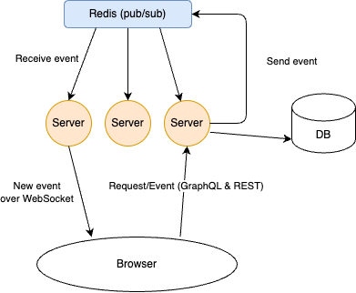

# About the project PT Chat

PT Chat is a hobby project to educate myself about FastApi, Pydantic, SqlAlchemy and GraphQL+Subcription over WebSocket. It is a simple chat app, where a user can create or join a room and chat with other users in the same room in real-time manner. In this project, I want to use the latest tech in the Python ecosystem, especially with FastAPI in order to see how it can be done. Therefore, the first fundamental thing is to use the async IO, which is core thing in Fast API and the thing that makes it Fast fast :) The other tech are Pydantic, a popular validation lib, bundled within Fast API and the SqlAlchemy, the most popular ORM lib atm for Python. Beside that, JWT is used as mechanism for authentication.

For disclaimer, the tech choices in the project is to focus on the tech I would like to try and learn, not necessarily the best choice for the application itself. For example, the backend is mixed of the Restful and the GraphQL endpoint, which in fact could be used only one style. However, all code is made as best as possible for production ready. I hope the code can be useful and can also be used as a reference for the same topic. The code is free to use or copy.

## How to build and run

### With Docker compose

The quick and easy way to run the project is with docker compose, go to root folder and run

```
$ docker-compose up       # or `docker-compose up -d`
```

The app should be available at http://localhost:5173

### Without Docker compose

The requirement is to have Python 3.12.8+ and Poetry installed in advance and frontend requires Node 20+. The repository contains both frontend and backend, first to to `backend` folder, and run `poetry install`. After that, run

```
$ poetry run uvicorn main:app --reload
```

Then go to `frontend` folder, first run `npm install` After that, run

```
$ npm run dev
```

The app should be available at http://localhost:5173

## Architecture

For handling GraphQL, the backend uses Strawberry, a new library recommended by FastApi for dealing with GraphQL. Besides, Redis is used as a pub/sub broker to notify the server for the new event such as new message or user joins or leaves a room. The use of Redis is for the case, FastAPI is deployed into multiple instances, all the GraphQL clients are notified.

The frontend uses React/TypeScript built with **Vite** and GraphQL-codegen for making GraphQL call. The UI and style utilise TailwindCSS and DaisyUI. The frontend is not the main focus in the project, beside how to Graphql codegen and the GraphQL subscription over WebSocket for the chat section, the style and UI is mostly generated by ChatGPT.

Between backend and frontend, for authentication, it uses the JWT as bearer token. The token is generated everytime a new user comes and register the name. The lifetime of a token is 24h and after that, users cannot use the token anymore and thus need to create a new user to use the service :)

Following is the architecture diagram for the solution.



Phong Le (C) 2025

